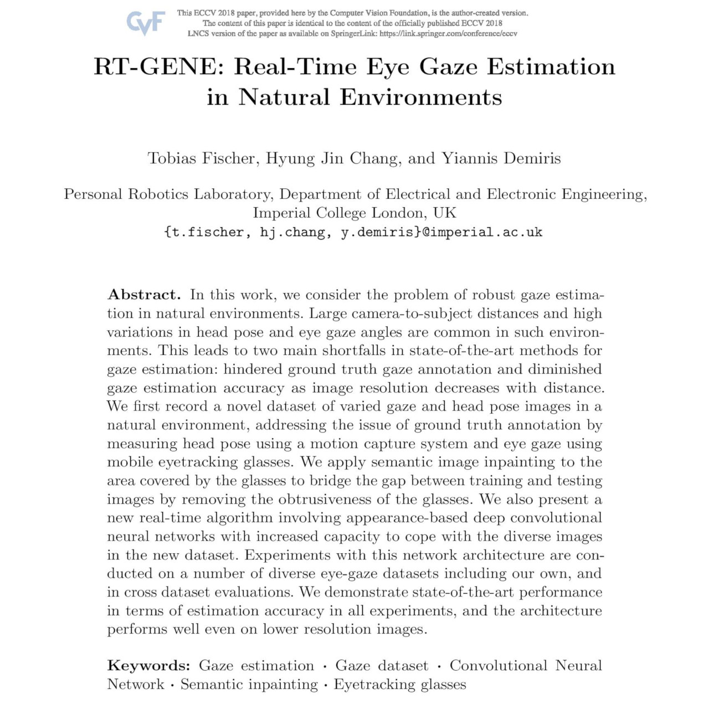
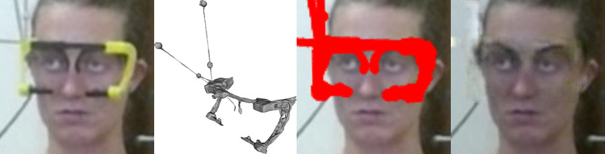
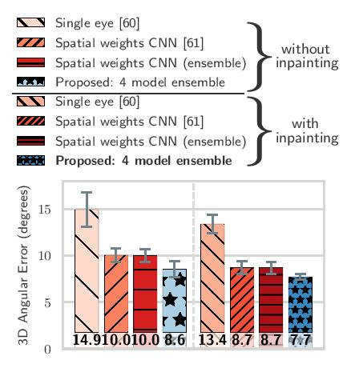
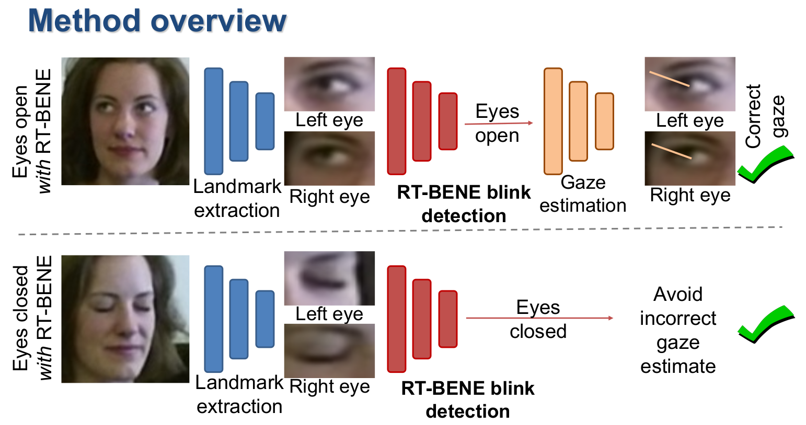
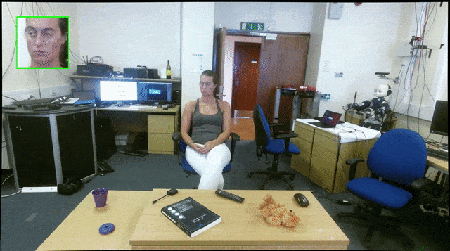
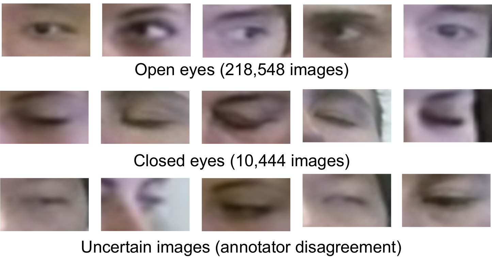

# RT-GENE & RT-BENE: Real-Time Eye Gaze and Blink Estimation in Natural Environments
[](https://creativecommons.org/licenses/by-nc-sa/4.0/)
[](./README.md)
[](https://github.com/Tobias-Fischer/rt_gene/stargazers)
[](https://github.com/Tobias-Fischer/rt_gene/issues)
[](./README.md)

[](https://paperswithcode.com/sota/gaze-estimation-on-mpii-gaze?p=rt-gene-real-time-eye-gaze-estimation-in?style=square)
[](https://paperswithcode.com/sota/gaze-estimation-on-rt-gene?p=rt-gene-real-time-eye-gaze-estimation-in)
[](https://paperswithcode.com/sota/gaze-estimation-on-ut-multi-view?p=rt-gene-real-time-eye-gaze-estimation-in)

[](https://paperswithcode.com/sota/blink-estimation-on-eyeblink8?p=rt-bene-a-dataset-and-baselines-for-real-time)
[](https://paperswithcode.com/sota/blink-estimation-on-researcher-s-night?p=rt-bene-a-dataset-and-baselines-for-real-time)
[](https://paperswithcode.com/sota/blink-estimation-on-rt-bene?p=rt-bene-a-dataset-and-baselines-for-real-time)

This repository contains code and dataset references for two papers: RT-GENE (Gaze Estimation; ECCV2018) and RT-BENE (Blink Estimation; ICCV2019 Workshops).

## RT-GENE (Gaze Estimation)

### License + Attribution
The RT-GENE code is licensed under [CC BY-NC-SA 4.0](https://creativecommons.org/licenses/by-nc-sa/4.0/). Commercial usage is not permitted. If you use this dataset or the code in a scientific publication, please cite the following [paper](http://openaccess.thecvf.com/content_ECCV_2018/html/Tobias_Fischer_RT-GENE_Real-Time_Eye_ECCV_2018_paper.html):



```
@inproceedings{FischerECCV2018,
author = {Tobias Fischer and Hyung Jin Chang and Yiannis Demiris},
title = {{RT-GENE: Real-Time Eye Gaze Estimation in Natural Environments}},
booktitle = {European Conference on Computer Vision},
year = {2018},
month = {September},
pages = {339--357}
}
```

This work was supported in part by the Samsung Global Research Outreach program, and in part by the EU Horizon 2020 Project PAL (643783-RIA).

### Overview + Accompanying Dataset
The code is split into four parts, each having its own README contained. There is also an accompanying [dataset](https://zenodo.org/record/2529036) [(alternative link)](https://goo.gl/tfUaDm) to the code. For more information, other datasets and more open-source software please visit the Personal Robotic Lab's website: <https://www.imperial.ac.uk/personal-robotics/software/>.

#### RT-GENE ROS package
The [rt_gene](./rt_gene) directory contains a ROS package for real-time eye gaze and blink estimation. This contains all the code required at inference time.

<p align="center">
  
</p>

#### RT-GENE Standalone Version
The [rt_gene_standalone](./rt_gene_standalone) directory contains instructions for eye gaze estimation given a set of images. It shares code with the `rt_gene` package (above), in particular the code in [rt_gene/src/rt_gene](./rt_gene/src/rt_gene).

#### RT-GENE Inpainting
The [rt_gene_inpainting](./rt_gene_inpainting) directory contains code to inpaint the region covered by the eyetracking glasses.



#### RT-GENE Model Training
The [rt_gene_model_training](./rt_gene_model_training) directory allows using the inpainted images to train a deep neural network for eye gaze estimation.

<p align="center">
  
</p>

## RT-BENE (Blink Estimation)

### License + Attribution
The RT-BENE code is licensed under [CC BY-NC-SA 4.0](https://creativecommons.org/licenses/by-nc-sa/4.0/). Commercial usage is not permitted. If you use our blink estimation code or dataset, please cite the relevant [paper](http://openaccess.thecvf.com/content_ICCVW_2019/html/GAZE/Cortacero_RT-BENE_A_Dataset_and_Baselines_for_Real-Time_Blink_Estimation_in_ICCVW_2019_paper.html):

```
@inproceedings{CortaceroICCV2019W,
author={Kevin Cortacero and Tobias Fischer and Yiannis Demiris},
booktitle = {Proceedings of the IEEE International Conference on Computer Vision Workshops},
title = {RT-BENE: A Dataset and Baselines for Real-Time Blink Estimation in Natural Environments},
year = {2019},
}
```

RT-BENE was supported by the EU Horizon 2020 Project PAL (643783-RIA) and a Royal Academy of Engineering Chair in Emerging Technologies to Yiannis Demiris.

### Overview + Accompanying Dataset
The code is split into several parts, each having its own README. There is also an associated [RT-BENE dataset](https://zenodo.org/record/3685316). For more information, other datasets and more open-source software please visit the Personal Robotic Lab's website: <https://www.imperial.ac.uk/personal-robotics/software/>. Please note that a lot of the code is shared with RT-GENE (see above), hence there are many references to RT-GENE below.



#### RT-BENE ROS package
The [rt_gene](./rt_gene) directory contains a ROS package for real-time eye gaze and blink estimation. This contains all the code required at inference time. For blink estimation, please refer to the [estimate_blink.py](./rt_gene/scripts/estimate_blink.py) file.

<p align="center">
  
</p>

#### RT-BENE Standalone Version
The [rt_bene_standalone](./rt_bene_standalone) directory contains instructions for blink estimation given a set of images. It makes use of the code in [rt_gene/src/rt_bene](./rt_gene/src/rt_bene).

#### RT-BENE Model Training
The [rt_bene_model_training](./rt_bene_model_training) directory contains the code required to train models with the labels contained in the RT-BENE dataset (see below). We will soon at evaluation code in this directory, too.

#### RT-BENE Dataset


We manually annotated images contained in the "noglasses" part of the RT-GENE dataset. The [RT-BENE dataset on Zenodo](https://zenodo.org/record/3685316) contains the eye image patches and associated annotations to train the blink models.
