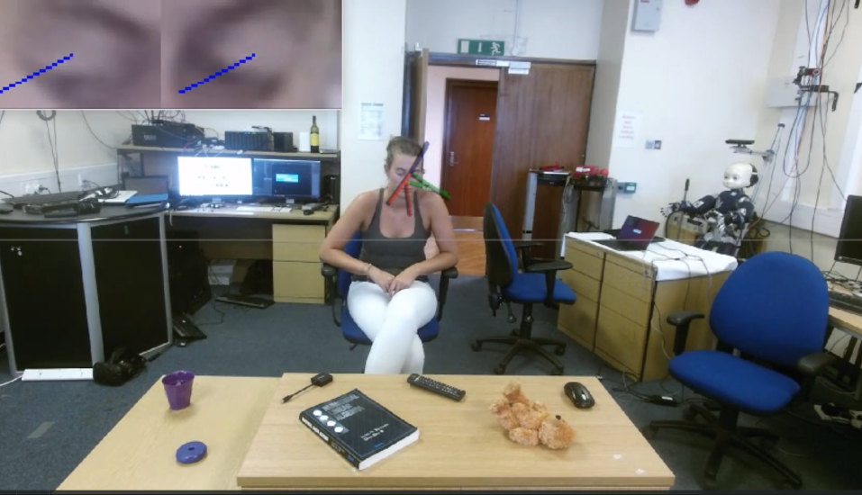
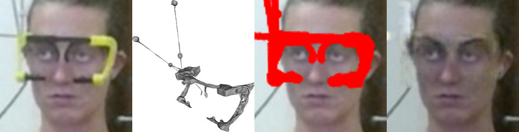
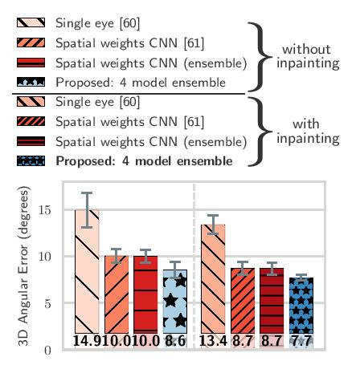

# RT-GENE: Real-Time Eye Gaze Estimation in Natural Environments
[](https://creativecommons.org/licenses/by-nc-sa/4.0/)
[](http://hits.dwyl.io/Tobias-Fischer/rt_gene)


## License + Attribution
This code is licensed under [CC BY-NC-SA 4.0](https://creativecommons.org/licenses/by-nc-sa/4.0/). Commercial usage is not permitted. If you use this dataset or the code in a scientific publication, please cite the following [paper](http://openaccess.thecvf.com/content_ECCV_2018/html/Tobias_Fischer_RT-GENE_Real-Time_Eye_ECCV_2018_paper.html):

```
@inproceedings{FischerECCV2018,
author = {Tobias Fischer and Hyung Jin Chang and Yiannis Demiris},
title = {{RT-GENE: Real-Time Eye Gaze Estimation in Natural Environments}},
booktitle = {European Conference on Computer Vision},
year = {2018},
month = {September},
pages = {339--357}
}
```

This work was supported in part by the Samsung Global Research Outreach program, and in part by the EU Horizon 2020 Project PAL (643783-RIA).

## Overview + Accompanying Dataset
The code is split into three parts, each having its own README contained. There is also an accompanying [dataset](https://zenodo.org/record/2529036) [(alternative link)](https://goo.gl/tfUaDm) to the code. For more information, other datasets and more open-source software please visit the Personal Robotic Lab's website: <https://www.imperial.ac.uk/personal-robotics/software/>.

### rt_gene (ROS package)
The [rt_gene](./rt_gene) directory contains a ROS package for real-time eye gaze estimation. This contains all the code required at inference time.



### rt_gene (Standalone)
The [rt_gene_standalone](./rt_gene_standalone) directory contains instructions for eye gaze estimation given a set of images. It relies on the `rt_gene` package (above).

### rt_gene_inpainting
The [rt_gene_inpainting](./rt_gene_inpainting) directory contains code to inpaint the region covered by the eyetracking glasses.



### rt_gene_model_training
The [rt_gene_model_training](./rt_gene_model_training) directory allows using the inpainted images to train a deep neural network for eye gaze estimation.

<p align="center">
  
</p>
