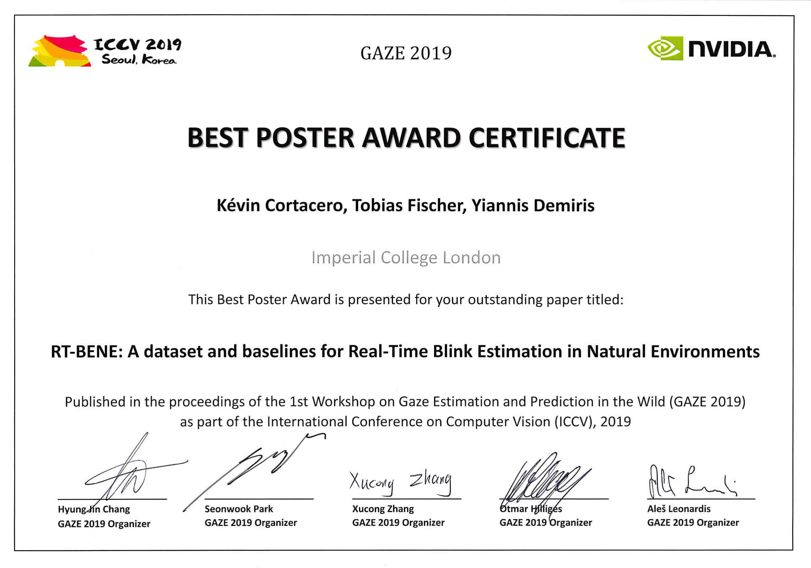
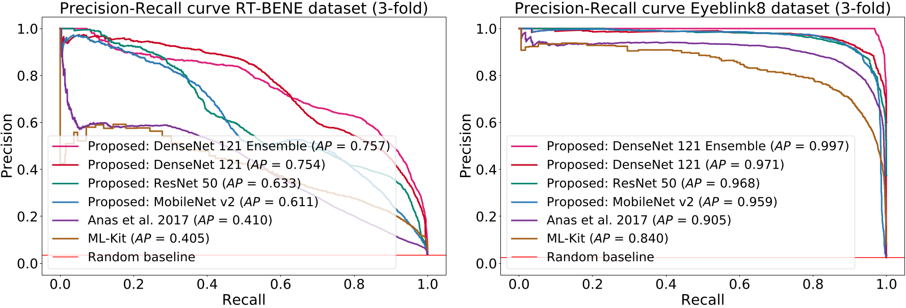

# RT-BENE: A Dataset and Baselines forReal-Time Blink Estimation in Natural Environments
[](https://creativecommons.org/licenses/by-nc-sa/4.0/)





## License + Attribution
This code is licensed under [CC BY-NC-SA 4.0](https://creativecommons.org/licenses/by-nc-sa/4.0/). Commercial usage is not permitted. If you use this dataset or the code in a scientific publication, please cite the following [paper](http://openaccess.thecvf.com/content_ICCVW_2019/html/GAZE/Cortacero_RT-BENE_A_Dataset_and_Baselines_for_Real-Time_Blink_Estimation_in_ICCVW_2019_paper.html):

```
@inproceedings{CortaceroICCV2019W,
author={Kevin Cortacero and Tobias Fischer and Yiannis Demiris},
booktitle = {Proceedings of the IEEE International Conference on Computer Vision Workshops},
title = {RT-BENE: A Dataset and Baselines for Real-Time Blink Estimation in Natural Environments},
year = {2019},
}
```

RT-BENE was supported by the EU Horizon 2020 Project PAL (643783-RIA) and a Royal Academy of Engineering Chair in Emerging Technologies to Yiannis Demiris.

More information can be found on the Personal Robotic Lab's website: <https://www.imperial.ac.uk/personal-robotics/software/>.

## Requirements
For pip users: `pip install tensorflow-gpu numpy tqdm opencv-python` or for conda users: `conda install tensorflow-gpu numpy tqdm opencv`

## Model training code
This code was used to train the blink estimator for RT-BENE. The labels for the RT-BENE blink dataset are contained in the [rt_bene_dataset](../rt_bene_dataset) directory. The images corresponding to the labels can be downloaded from the RT-GENE dataset (labels are only available for the "noglasses" part): [download](https://zenodo.org/record/2529036) [(alternative link)](https://goo.gl/tfUaDm). Please run `python train_blink_model.py --help` to see the required arguments to train the model.

## Model testing code
The evaluation code will be provided soon; please check back.



