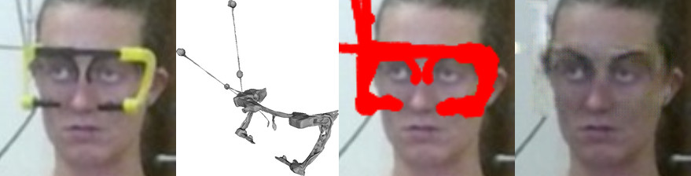

# RT-GENE: Real-Time Eye Gaze Estimation in Natural Environments
[](https://creativecommons.org/licenses/by-nc-sa/4.0/)





## License + Attribution
This code is licensed under [CC BY-NC-SA 4.0](https://creativecommons.org/licenses/by-nc-sa/4.0/). Commercial usage is not permitted; please contact <info@tobiasfischer.info> or <y.demiris@imperial.ac.uk> regarding commercial licensing. If you use this dataset or the code in a scientific publication, please cite the following [paper](http://openaccess.thecvf.com/content_ECCV_2018/html/Tobias_Fischer_RT-GENE_Real-Time_Eye_ECCV_2018_paper.html):

```
@inproceedings{FischerECCV2018,
author = {Tobias Fischer and Hyung Jin Chang and Yiannis Demiris},
title = {{RT-GENE: Real-Time Eye Gaze Estimation in Natural Environments}},
booktitle = {European Conference on Computer Vision},
year = {2018},
month = {September},
pages = {339--357}
}
```

This work was supported in part by the Samsung Global Research Outreach program, and in part by the EU Horizon 2020 Project PAL (643783-RIA).

More information can be found on the Personal Robotic Lab's website: <https://www.imperial.ac.uk/personal-robotics/software/>.

## Requirements
- pip: `pip install tensorflow-gpu keras numpy scipy<=1.2.1 tqdm matplotlib pyamg`
- conda: `conda install tensorflow-gpu keras numpy scipy<=1.2.1 tqdm matplotlib pyamg`

## Inpainting source code
This code was used to inpaint the region covered by the eyetracking glasses. There are two parts: 
1) training subject-specific GANs using the images where no eyetracking glasses are worn (`GAN_train.py` and `GAN_train_run.ipynb`) and 
2) the actual inpainting using the trained GANs (`GlassesCompletion.py` and `GlassesCompletion_run.py`). 

In `GAN_train_run.ipynb` and `GlassesCompletion_run.py` the `dataset_folder_path` needs to be adjusted to where the dataset was downloaded to.

## List of libraries
- [./external/poissonblending.py](./external/poissonblending.py): [MIT License](https://opensource.org/licenses/MIT); [Link to GitHub](https://github.com/parosky/poissonblending)
- Some code taken from [DC-GAN](https://github.com/Newmu/dcgan_code): [MIT License](https://github.com/Newmu/dcgan_code/blob/master/LICENSE); [Link to GitHub](https://github.com/Newmu/dcgan_code)
- Tensorflow; [Apache License 2.0](https://www.apache.org/licenses/LICENSE-2.0), [Link to website](http://tensorflow.org/)
- Keras; [MIT License](https://opensource.org/licenses/MIT), [Link to website](https://keras.io)

