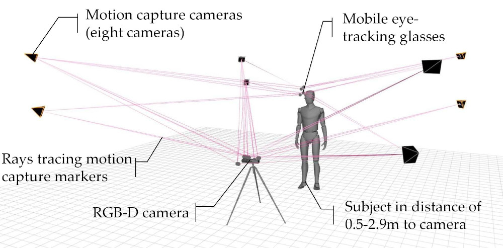

# RT-GENE: Real-Time Eye Gaze Estimation in Natural Environments
[](https://creativecommons.org/licenses/by-nc-sa/4.0/)





## License + Attribution
This code is licensed under [CC BY-NC-SA 4.0](https://creativecommons.org/licenses/by-nc-sa/4.0/). Commercial usage is not permitted; please contact <info@tobiasfischer.info> or <y.demiris@imperial.ac.uk> regarding commercial licensing. If you use this dataset or the code in a scientific publication, please cite the following [paper](http://openaccess.thecvf.com/content_ECCV_2018/html/Tobias_Fischer_RT-GENE_Real-Time_Eye_ECCV_2018_paper.html):

```
@inproceedings{FischerECCV2018,
author = {Tobias Fischer and Hyung Jin Chang and Yiannis Demiris},
title = {{RT-GENE: Real-Time Eye Gaze Estimation in Natural Environments}},
booktitle = {European Conference on Computer Vision},
year = {2018},
month = {September},
pages = {339--357}
}
```

This work was supported in part by the Samsung Global Research Outreach program, and in part by the EU Horizon 2020 Project PAL (643783-RIA).

More information can be found on the Personal Robotic Lab's website: <https://www.imperial.ac.uk/personal-robotics/software/>.

## Requirements
- `pip install tensorflow-gpu numpy scipy tqdm matplotlib h5py scikit-learn pytorch_lightning torch torchvision Pillow`
- Run the [rt_gene/scripts/download_models.py](../rt_gene/scripts/download_models.py) script to download the required model files

## Model training code (tensorflow)
This code was used to train the eye gaze estimation CNN for RT-GENE. 
- First, the h5 files need to be created from the RAW images. We use the [prepare_dataset.m](./tensorflow/prepare_dataset.m) MATLAB script for this purpose. Please adjust the `load_path` and `save_path` variables. The `augmented` variable can be set to `0` to disable image image augmentations described in the paper. The `with_faces` variable can be set to `1` to also store the face images in the *.h5 files (warning: this requires a lot of memory).
- Then, the [train_model.py](./tensorflow/train_model.py) file can be used to train the models in the 3-Fold setting as described in the paper. An example to call this script is given in the [train_models_run.sh](./tensorflow/train_models_run.sh) file.
- Finally, the [evaluate_model.py](./tensorflow/evaluate_model.py) can be used to get the individual models' performance as well as the ensemble performance. An example to call this script is given in the [evaluate_models.sh](./tensorflow/evaluate_models.sh) file.

## Model training code (pytorch)
- First, generate the new patches from the new RT-GENE pipeline using [GenerateEyePatchesRTGENEDataset.py](./pytorch/utils/GenerateEyePatchesRTGENEDataset.py). This will create new directories inside "RT_GENE/subject/inpainted": "left_new" and "right_new".
- Compile the left_new and right_new patches along the labels into a h5 file using [GenerateRTGENEH5Dataset.py](./pytorch/utils/GenerateRTGENEH5Dataset.py), optionally augment the patches here to make it as similar to [prepare_dataset.m](./tensorflow/prepare_dataset.m) from the tensorflow preparation stage.
- Run [train_model.py](./pytorch/train_model.py) on the h5 dataset generated. This will take a while. Available options can be viewed by running `train_model.py --help`.
- Finally, run [post_process_ckpt.py](./pytorch/post_process_ckpt.py) on the generated `ckpt` files to turn them into models (reduces file size) 

## List of libraries
- Tensorflow; [Apache License 2.0](https://www.apache.org/licenses/LICENSE-2.0), [Link to website](http://tensorflow.org/)
